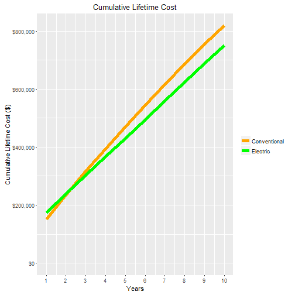

Conventional vs. Electric Truck Lifetime Cost Calculator
========================================================
author: Chase LeCroy
date: 08/21/16

Problem Statement
========================================================


- There have been many recent developments in the heavy dutry electric truck industry.
- Electric trucks provide a good alternative to conventional because they have far lower emissions, lower maintenance costs, and can be fuelled anywhere there is electricity.
- However, electric vehicles generally have greater upfront costs than conventional.
- The lifetime cost of electric vehicles can be less than that of conventional vehicles, but this is often not clear.

Solution
========================================================

- Many fleets are unfamiliar with these new electric technologies and their costs and benefits.
- There are many inputs to consider when comparing the total costs with conventional vehicles.
- This calculator seeks to address these problems by providing a simple interface for comparing liftime vehicle costs between electric and conventional trucks.


Shiny Application
========================================================

- This Shiny application takes inputs from the most common costs associated with truck usage and computes an estimate of total lifetime cost for an electric and conventional truck
- The format makes it easy to use and the results are updated reactively.
- In addition, the plot provides a visual reference for the break even point.
  + I.E., when the two lines on the plot intersect, the cumulative costs of the different vehicles are equivalent.

Conventional Lifetime Fuel Cost
============
The equation below shows how total lifetime fuel cost is calculated for conventional trucks.

```r
for (i in 1:VehLife){
  TotFuelCost[i] <- (365 * (VehDRange / Mpg) * DieselPrice) * 
    ((1 + FuelEscRate) ^ VehLife - i))
        }
```
      Variable        | Value
      --------------- | ---------------------------
      VehLife         |  Vehicle lifetime (years)
      TotFuelCost[i]  |  Total fuel cost in year i
      VehDRange       |  Vehicle daily range (miles)
      Mpg             |  Miles per gallon
      DieselPrice     |  Price of diesel ($/gal)
      FuelEscRate     |  Percent increase in fuel prices each year

Conventional Lifetime Maintenace and Upfront Cost
=========
Lifetime maintenance cost and upfront vehicle cost are added to the sum from the previous slide. Upfront cost is simply the purchase price, while lifetime maintenace cost is claculated as:

```r
      LifeMaintCost <- VehLife * 365 * VehMaintCost
```
      Variable        | Value
      --------------- | ---------------------------
      VehLife         |  Vehicle lifetime (years)
      VehMaintCost    |  Vehicle maintenance cost ($/mile)
      LifeMaintCost   |  Lifetime maintenance cost ($)

Electric Lifetime Fuel, Maintenace, Upfront, and Infrastructure Cost
=========
The total lifetime fuel and maintenance costs are calculated in the same way for electric vehicles, but electric vehicles have the added cost of infrastructure, representing the cost of installing chargers, running cables, etc. This cost can vary widely depending on the circumstances at each site.

Plotting Cumulative Lifetime Cost
=========

***
This plot shows the intial settings for the Shiny application. While the price for the electric truck is higher in the first year, by year 3 the total cost of the conventional truck is higher.

Thank you for reviewing my project!
======
Hopefully this can serve as a useful tool for fleets interested in learning more about electric trucks.
